# 🌸 Anime Companion for VS Code

> **Language**: **English** · [Tiếng Việt](docs/README.vi.md) · [日本語](docs/README.ja.md)

> A cute Live2D companion that lives in your VS Code panel and reacts to your coding flow — errors, saves, commits, builds, debug sessions, Pomodoro… **and now chats with you** through GitHub Copilot or your own API key (Anthropic / OpenAI / Gemini / xAI / DeepSeek / OpenRouter / Ollama).

> ⚠️ **Experimental — v0.5.x.** This is an early-access build. APIs, settings, and behavior may shift between minor versions before v1.0. Bugs or feedback are very welcome via [GitHub Issues](https://github.com/xShiroeNguyenx/anime-companion-vscode/issues).

**Current version:** v0.5.4

> 🆕 **What's new in v0.5.4**:
> - **🔄 Rotate the model by hand** — hold **Alt + left-drag** to turn the companion's head and body toward where you drag (a bounded 2.5D look-toward via the Live2D focus controller; eases back to idle on release).
> - **👀 Auto look-at cursor** — a new right-click toggle (**Appearance › Auto look-at cursor**) makes the head and eyes follow your mouse hands-free while it hovers; the choice is remembered. Whip the cursor back and forth too fast and the companion gets "dizzy" and asks you to slow down.
>
> Builds on **v0.5.3**'s 🔗 background image from a URL, **v0.5.1**'s 🌸 Markdown WYSIWYG editor, **v0.5.0**'s 🖼️ Background Image control panel, **v0.4.3**'s Claude account swap, and **v0.4.0**'s Agent Accounts + 💬 Pet Quick Chat.

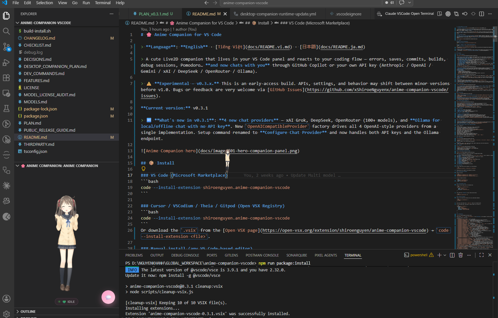

## 📦 Install

### VS Code (Microsoft Marketplace)
```bash
code --install-extension shiroenguyen.anime-companion-vscode
```

### Cursor / VSCodium / Theia / Gitpod (Open VSX Registry)
```bash
code --install-extension shiroenguyen.anime-companion-vscode
```
Or download the `.vsix` from the [Open VSX page](https://open-vsx.org/extension/shiroenguyen/anime-companion-vscode) → `code --install-extension <file>`.

### Manual install (any VS Code-based editor)
1. Grab the latest `.vsix` from [GitHub Releases](https://github.com/xShiroeNguyenx/anime-companion-vscode/releases).
2. In the editor: `Ctrl+Shift+P` → **Extensions: Install from VSIX...** → pick the downloaded file.

---

## ✨ Features

### 🌸 Markdown editor (WYSIWYG) — in its own window

- **Edit `.md` files visually, like a rich-text editor** (à la CKEditor) — no split preview, no wrestling with raw syntax. Click the **🌸 flower** on the editor title bar (or the pulsing **🌸** status-bar item) to open the current Markdown file in a **full-size tab** of its own (not a split).
- **Writes straight back to the file** on Save (`Ctrl/Cmd+S` works too), kept in sync with any normal editor tab. **Safe by design:** it only writes when you actually edit, so just previewing never touches the file — with a one-time heads-up that saving normalizes Markdown formatting.
- **🌗 Dark / Light** toggle in the header, remembered across files and windows.
- **🎨 Custom theme colour** — a colour swatch in the header recolours the whole accent (header, buttons, borders, links, scrollbar) to any colour, with a **↺ reset** to the default sakura pink; remembered across files and windows. The page background keeps following Dark / Light mode.
- **Slim scrollbar** — a thin, accent-coloured bar (auto-hiding where the platform supports it) instead of the chunky default.
- **Anime Companion look** — sakura-pink header with a bobbing 🌸, a candy Save button, themed toolbar, and cute fonts.

**Quick start:** open any `.md` file → click the **🌸** button (top-right of the editor) or run `Open in Anime Markdown Editor` from the Command Palette.

> ⚠️ Editing through a WYSIWYG editor normalizes Markdown formatting on save (list markers, emphasis, spacing, raw HTML). That's exactly why the editor never writes unless you actually make a change.

### 🖼️ Background Image (workbench) — with a real control panel

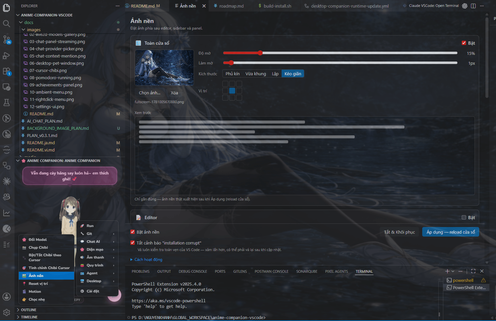

- **Put your own image behind VS Code** — the editor, sidebar, and panel — or one **Fullscreen** image across the whole window. Like the popular "Background" extension (it patches VS Code's workbench, since there's no public API for this), but the whole point here is a **visual control panel** instead of fiddly JSON.
- **Per-region or whole-window:**
  - 🪟 **Fullscreen** — one image over the entire window (editor + sidebar + panel + activity/status bars).
  - 📝 **Editor / 📁 Sidebar / 🖥️ Panel** — a separate image *behind the text* of each region, each independently toggled.
- **Friendly controls** for every region: image picker with thumbnail, **opacity** / **blur** / **sizing** (cover / contain / repeat / stretch) / **position** (3×3 grid), and an in-panel **live preview**.
- **Honest, guided lifecycle** — the pain points the JSON-only extensions hide are surfaced inline:
  - **Apply (reloads window)** to see changes; **Disable & Restore** to cleanly revert.
  - Auto re-applies after a VS Code update; cleans itself up on uninstall (`vscode:uninstall` hook).
  - Opt-in **"silence the installation-corrupt warning"** toggle (patches `product.json` checksums).
  - Clear notes about reload / re-apply-after-update / Administrator-if-in-Program-Files.
- **Localized** — the panel follows your message language (vi / en / ja) and updates live when you change it.

**Quick start:** Command Palette → `Background Image: Open Control Panel` (or the companion right-click menu → **Appearance › 🖼️ Background Image**) → pick an image → **Apply**.

> ⚠️ Background changes need a **window reload**, must be **re-applied after VS Code updates**, and on a Program Files install may need running VS Code as Administrator once. The panel explains all of this. v1 targets **desktop VS Code stable** (works on Cursor too).

### 💬 AI Chat Companion

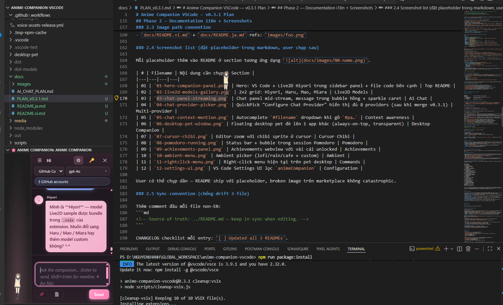

- **Chat directly with the companion** through a slide-in panel next to the Live2D character. Ask about the code you're writing, brainstorm ideas, learn a new framework — the companion stays in its anime persona while answering.
- **8 LLM providers, one default needs no key:**
  - 🟢 **GitHub Copilot (default, no API key)** — uses your existing Copilot subscription via `vscode.lm`. Supports every model Copilot exposes: gpt-4o, claude-3.5/3.7-sonnet, gemini-1.5-pro, o1-mini, …
  - 🤖 **Anthropic Claude (BYOK)** — claude-opus-4-7, claude-sonnet-4-6, claude-haiku-4-5.
  - 🤖 **OpenAI GPT (BYOK)** — gpt-4o, gpt-4o-mini, o1-mini.
  - 🤖 **Google Gemini (BYOK, free tier)** — gemini-2.5-flash/pro/flash-lite, gemini-2.0-flash.
  - 🆕 **xAI Grok (BYOK)** — grok-2-latest, grok-3, grok-beta.
  - 🆕 **DeepSeek (BYOK)** — deepseek-chat, deepseek-reasoner (chain-of-thought hidden).
  - 🆕 **OpenRouter (BYOK)** — gateway to 100+ models including `:free` tier (Claude, GPT, Llama, Gemini, DeepSeek, …) through a single key.
  - 🆕 **Ollama (local, no key)** — talks to a local Ollama server (default `http://localhost:11434`). Fully offline. Pull any model with `ollama pull llama3.2`.

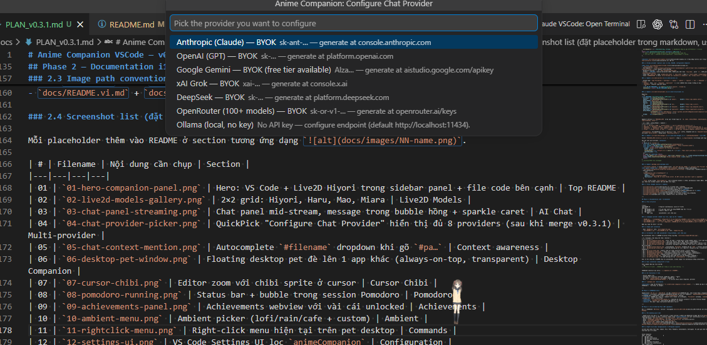

- **Secure BYOK**: API keys are stored in VS Code SecretStorage (OS keychain encrypted). The webview never sees the key.
- **Streaming token-by-token** with a sparkle caret ✨ and 3-dot pink thinking animation while waiting.
- **Multi-conversation**: history persists across restarts. List / rename / delete in the sidebar. Active conversation pinned per-workspace.
- **Context awareness:**
  - 📌 Toggle to attach editor selection.
  - 📄 Toggle to attach the whole active file.
  - `#filename` autocomplete picker scoped to the workspace.
  - Right-click code → "Ask Companion About Selection" → stages selection + opens chat.

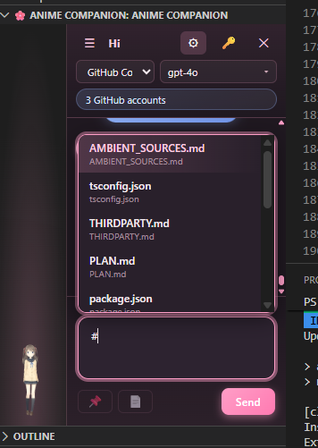

- **Sentiment reactions**: the companion visibly reacts to its own reply — happy answer → `TapBody` + happy mood; thinking → `TapHead` + idle; sad/error → sleepy.
- **Copy reply** with one click: every finalised assistant bubble shows a small clipboard icon at the bottom-right (hidden during streaming). Click swaps to a checkmark with a pop animation and the bubble flashes green. Copies the raw markdown source — code-block "Copy" buttons inside the reply don't leak into the clipboard.
- **Persona**: 4 presets (`cute` / `professional` / `tsundere` / `energetic`) or a fully custom system prompt.
- **Avatar + name** come from the current Live2D model — assistant bubble shows "Hiyori" or "Miara" instead of a generic "Companion".

**Quick start:**
1. Open the Anime Companion panel (bottom panel or `Ctrl+Shift+P` → `Anime Companion: Show`).
2. Click the 💬 button in the bottom-right to open the chat panel.
3. The default provider is **GitHub Copilot** — if you're already signed in to Copilot in VS Code, just type and Send.
4. Want to use BYOK or Ollama? Click ⚙ → pick a provider → click 🔑 → paste the key (or set the endpoint for Ollama).

### 🎭 Live2D Companion

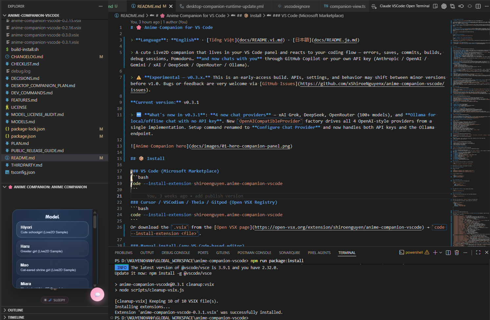

- **4 Live2D Sample models** under Free Material License: **Hiyori**, **Haru**, **Mao**, **Miara**. Hiyori is bundled in the `.vsix`; the other three lazy-download the first time you pick them.
- Rendered via `pixi-live2d-display` + Cubism Core through a local HTTP server (to bypass VS Code's CSP).
- **Live panel resize**: drag the VS Code panel taller/shorter/wider and the character refits in real time. Works both in default flex layout and after you've dragged the companion to a custom spot — feet never clip thanks to a small bottom breathing margin for animation sway.
- Falls back to a static image if Live2D fails to load.
- Smooth expression blending through PIXI ticker — mood transitions don't jitter.
- **Hands-on interaction**: **Alt + left-drag** turns the head/body toward the cursor (bounded ~±30° — Live2D is 2.5D, not a true 360° spin), and an **Auto look-at cursor** toggle (right-click → **Appearance**) makes the gaze follow your mouse hands-free. Wiggle the cursor back and forth too fast and the companion gets dizzy and asks you to slow down. Click/double-click still poke, long-press still headpats.
- Add your own local models via `animeCompanion.customModelRoots` or `animeCompanion.customModels` (see [MODEL_LICENSE_AUDIT.md](MODEL_LICENSE_AUDIT.md)).
- When you have a workspace open, the model is remembered per-workspace; there's a command to reset back to your global model.

### 🐥 Cursor Chibi

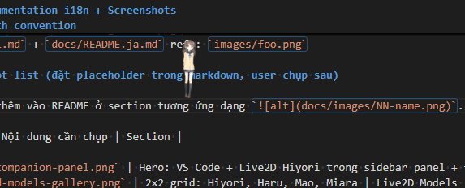

- Toggle a **chibi sprite that follows the editor cursor** via `Anime Companion: Toggle Cursor Chibi` or the `animeCompanion.cursorChase.enabled` setting.
- `Anime Companion: Tune Cursor Chibi Position` lets you nudge it live with `Up/Down/Left/Right` + resize, then saves to global settings.
- **Capture a chibi directly from the rendered Live2D model** via `Anime Companion: Capture Chibi from Model`. The extension auto-crops the transparent background, scales it down, and uses it as the sprite for the active model.
- `Anime Companion: Reset Captured Chibi` clears the captured PNG and falls back to the bundled icon.
- The chibi only follows real editors (`file`, `untitled`, `vscode-userdata`) to avoid leaking into Output / Debug Console.

### 🪪 Agent Accounts (Claude / Codex credential swap)

- **Save multiple agent-CLI logins and swap between them without re-authenticating.** The companion snapshots the credential files of each logged-in CLI tool, then atomically restores them when you switch — same mechanic as a hand-rolled PowerShell account-swap script, ported to cross-platform Node `fs` and tied into the pet's right-click menu.
- **Tool-agnostic backend registry** — adding a new CLI is a single backend file (`AccountBackend` interface) + one `registerBackend(...)` line. The whole UI (popups, panel, status bar, command palette) discovers tools through that registry.
- **Backends shipped:**
  - 🤖 **Claude Code** — snapshots `~/.claude/.credentials.json` + adjacent settings; identity shown as `sub=team · org=09eb97ad · exp=…` so you can tell two accounts apart at a glance.
  - ⚡ **Codex** — snapshots `~/.codex/auth.json`; identity shown as `mode=chatgpt · user@example.com · plan=plus` (email + plan decoded from the OAuth `id_token` payload, never the token itself).
- **Per-tool active detection** — instead of trusting the last in-extension switch, the extension reads the live credential of each backend and matches it against your saved snapshots. So an external swap (e.g. running your own PowerShell script) is reflected correctly in the status bar and panel. Several tools can be "active" simultaneously — Claude account A *and* Codex account B at the same time.
- **In-webview popups at the pet** — right-click the pet → **Agent ›**:
  - **🔁 Đổi nhanh / Quick Switch** — list profiles grouped by tool (`🤖 Claude (2)` / `⚡ Codex (1)`), click a row to swap.
  - **💾 Save Current as…** — inline tool picker (auto-selected if only one CLI is logged in) + name input, all attached to the pet — no VS Code QuickPick interruption.
  - **👀 Manage Profiles…** — standalone webview panel with Use / Rename / Delete + per-tool sections.
- **Status bar item** — shows the active profile (or "N accounts" with a per-tool tooltip when multiple tools are active). Click → Quick Switch.
- **Atomic, safe restore** — every restore writes each file via `<final>.tmp` + `fs.rename`. Rolling 3-backup retention per tool before each restore. Snapshot directory missing? Refuses to clobber your live credentials.
- **Restart hint** — after every swap the extension reminds you to restart any running CLI session so it reloads the new token. It does not detect or kill CLI processes.

**Quick start:**
1. Log in to `claude` (or `codex`) in any terminal so the credential file exists.
2. Right-click the pet → **Agent → 💾 Save Current as…** → name the profile (e.g. `work`).
3. Log out, log in to the second account, repeat with a different name (e.g. `personal`).
4. Right-click the pet → **Agent → 🔁 Quick Switch** → pick → the credential file is swapped instantly. Restart your CLI to use the new account.

### 🪟 Desktop Companion (Windows v1)

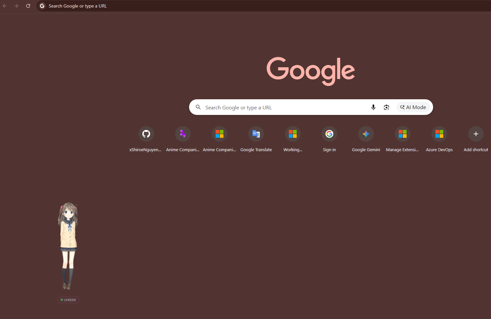

- Run the companion as a **floating desktop window** instead of just inside the VS Code panel.
- Enable with `animeCompanion.desktopCompanion.enabled`, then reload the window.
- When Desktop Companion is on, the VS Code panel auto-hides so you don't have two Live2D instances at once.
- The desktop pet binary is **lazy-downloaded** from GitHub Releases on first launch. Override with `animeCompanion.desktopCompanion.devBinaryPath` for local testing.
- Supports `alwaysOnTop`, `clickThrough`, `size`, `position`, `opacity`.
- v1 is **Windows-only**. Mac/Linux binaries are planned for a later release.

### 💫 Interactions

- **Single Click** — gentle touch (Surprised).
- **Double / Triple Click** — happy (Happy).
- **Long Press > 0.8s** — Headpat → Shy → Love with heart effects.
- **Spam Click** — angry response ("Stop poking me!").

### 🔊 Audio + Lip-sync in 3 languages

- **Japanese (ja)** — VoiceVox Shikoku Metan, anime-style JP voice.
- **Vietnamese (vi)** — bundled lines + extended voice assets lazy-downloaded when needed.
- **English (en)** — bundled lines + extended voice assets lazy-downloaded when needed.
- Bubble text and voice are independent: voice can be `ja` while text is `vi` / `en` / `ja`.
- Automatic lip-sync via `model.speak()`, falls back to HTML5 Audio if the PIXI Audio plugin hiccups.
- Disable extended voice assets with `animeCompanion.voiceAssets.enableExtended` if you only want the bundled audio.

### 🎧 Background Ambient

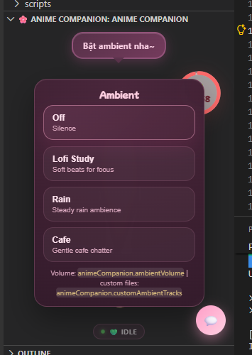

- **3 built-in presets**: **Lofi**, **Rain**, **Cafe**.
- Ambient loops independently from the companion's voice, so you hear reaction lines AND background music at the same time.
- Turn off entirely with the `off` preset, or adjust volume via `animeCompanion.ambientVolume`.
- Add **custom local ambient tracks** via `animeCompanion.customAmbientTracks`.

### 🤖 Reactive Engine — reacts to your coding environment

| Event | Reaction |
|---|---|
| Errors increase / decrease in Problems panel | Whine / praise bubble |
| Save spam (Ctrl+S repeatedly) | "Ctrl+S warrior detected! 🛡️" |
| Fast typing | "Speed coding mode activated! 💨" |
| Typing `TODO` / `FIXME` / `console.log` | Easter egg per keyword |
| User-defined custom keywords | Custom bubble via `animeCompanion.customKeywords` |
| Build success / fail | "Build OK! 🎉" / "Broken! 😭" |
| Debug start / stop | "Detective mode: ON 🕵️" |
| Git branch switch | "Switched branch? 🌿" |
| New commit | "Nice commit! 💪" |
| Merge conflict | "Merge conflict over there! 😨" |
| Many uncommitted files | "{count} files changed, commit soon!" |
| 30 min of continuous coding | Break reminder, drink water |
| Idle / many errors / coding streak | Mood swaps to `sleepy` / `angry` / `happy` |

Every channel can be toggled independently in settings.

### 🏆 Achievements

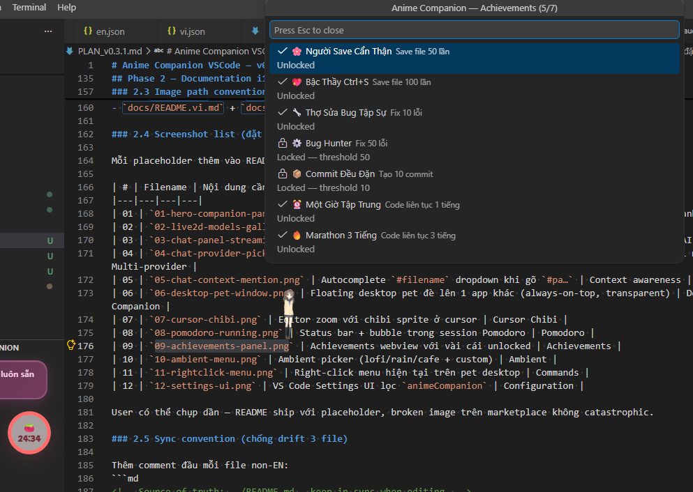

- Built-in **23-achievement set**: 6 progression chains for `save`, `bug fixes`, `commits`, `coding time`, `AI chat`, and `Pomodoro`, plus 4 secret achievements.
- Achievements now render in an inline **evolution tree** view, with rarity (`Common` → `Mythic`), tiered progression lanes, rarity-based unlock toast effects, and a separate secret lane with hints until unlocked.
- The same panel now includes **daily / weekly quests** and a lightweight **companion memory** feed that recalls unlocked achievements and cleared quests.
- Local-first **reward economy** is now tied to that progression loop: achievements and quests grant `gems`, `tickets`, cosmetics, and voice packs that stay on this machine with no backend sync required.
- Built-in command to view achievements in the tree UI, with a Quick Pick fallback when the panel is unavailable.

### 📊 Stats
- Tracks `save` count, `commit` count, errors fixed, today's coding time, all-time coding time, AI prompt usage, Pomodoro totals, quest progress, and recent shared memories.
- Includes a compact **profile surface** with level, affinity, inventory, top achievement, and local unlock collections, plus **PNG share-card export**.
- Built-in command for a quick stats view.

### 🍅 Pomodoro

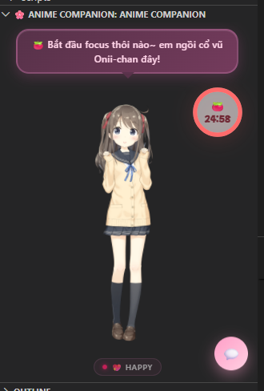

- Automatic work/break loop (default 25/5 min, configurable).
- Status bar shows `🔥 23:42` during focus, `☕ 04:12` during break.
- Visual ring overlay on the character.
- Click the status bar to stop quickly.

### 🖱️ Custom Right-click Menu

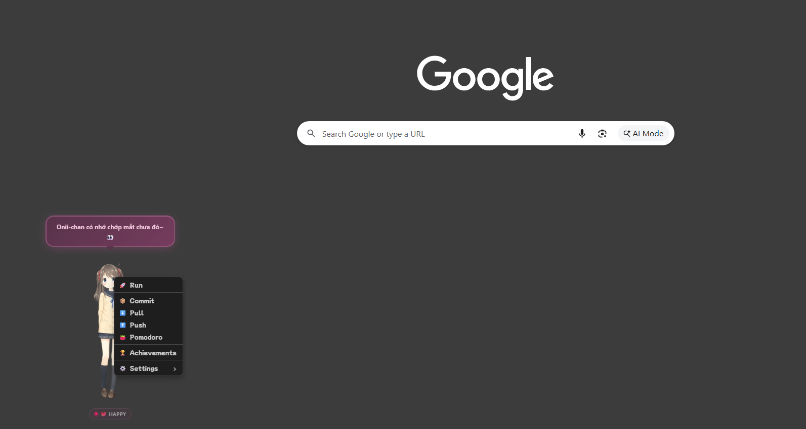

Right-click on the companion to open an inline menu — no Command Palette needed:

- 🚀 **Run** — restart-or-start debug session
- 🔧 **Git** — `Commit`, `Pull`, `Push`
- 💬 **AI Chat** — `Quick Chat`; in panel mode also `Open Chat`, `New Conversation`, `Ask About Selection`, `Configure Provider`, `Clear All`
- 🌸 **Appearance** — `Model`, `Capture Chibi`, `Toggle Cursor Chibi`, `Tune Cursor Chibi`, `Reset Position`, `Motion`, `Poke`
- 🔊 **Voice & Sound** — `Voice`, `Messages`, `Ambient`, `Mute` / `Unmute`
- 🍅 **Workflow** — `Start Pomodoro`, `Stop Pomodoro`, `Stats`, `Achievements`, `Quests`, `Profile`, `Share Card`
- 🪪 **Agent** — `Manage Profiles…`, `Quick Switch…`, `Save Current as…`, `GitHub Account…` (swap Claude · Codex · GitHub accounts; popups attached to the pet)
- 🖥️ **Desktop Companion** — `Switch to Desktop` / `Switch to Panel`, desktop-only `Toggle Click-Through`, `Reset Workspace Model`
- ⚙️ **All Settings** — open Settings UI pre-filtered

### 🌙 Quiet Hours

Set time ranges that mute every bubble — e.g. during meetings:

```json
"animeCompanion.quietHours": ["09:00-12:00", "22:00-06:00"]
```

Mood/expression still update — only messages are silenced.

### 🪄 Custom Phrases & Keywords

Add your own lines:

```json
"animeCompanion.customPhrases.idle": ["Remember to drink water~"],
"animeCompanion.customPhrases.save": ["Beautiful save!"],
"animeCompanion.customPhrases.error": ["Calm down, you got this."]
```

Or your own keyword reactions:

```json
"animeCompanion.customKeywords": {
  "refactor": ["Clean refactor~"],
  "NOTE": ["New note dropped!"]
}
```

### 🎵 Custom Ambient Tracks

Add your own local audio files to the Ambient menu:

```json
"animeCompanion.customAmbientTracks": [
  {
    "label": "My Lofi",
    "path": "D:/Music/lofi.mp3",
    "description": "Personal focus mix"
  }
]
```

Then right-click → **Ambient** to pick. Shared volume setting:

```json
"animeCompanion.ambientVolume": 30
```

### 📁 Custom Local Models

Point at a root folder that contains your local Live2D model subfolders:

```json
"animeCompanion.customModelRoots": [
  "D:/model"
]
```

Each direct child folder with a `.model3.json` shows up in the model picker.

For custom display name / description / specific model file, override via:

```json
"animeCompanion.customModels": {
  "my-model": {
    "name": "My Model",
    "path": "D:/model/MyModel",
    "modelFile": "MyModel.model3.json",
    "description": "Custom local model"
  }
}
```

---

## ⚙️ Configuration

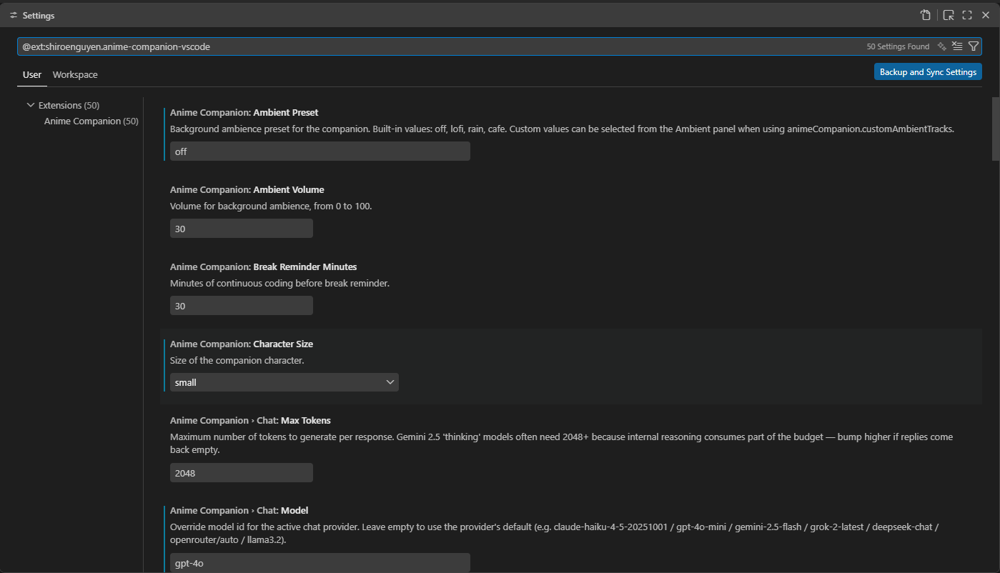

Open Settings (`Ctrl+,`) → search `Anime Companion`, or click **Settings** in the companion's right-click menu.

| Setting | Default | Description |
|---|---|---|
| `animeCompanion.model` | `hiyori` | Active Live2D model. |
| `animeCompanion.customModelRoots` | `[]` | Root folders to auto-scan for local Live2D models. |
| `animeCompanion.customModels` | `{}` | Declare extra user-supplied local models. |
| `animeCompanion.modelDownloadBaseUrl` | GitHub Releases URL | Base URL for lazy-downloading model zips. |
| `animeCompanion.voiceLanguage` | `ja` | `ja` / `vi` / `en` for audio. |
| `animeCompanion.messageLanguage` | `vi` | `vi` / `en` / `ja` for bubble text. |
| `animeCompanion.muted` | `false` | Mute all audio. |
| `animeCompanion.ambientPreset` | `off` | Current ambient: `off` / `lofi` / `rain` / `cafe` or a custom track. |
| `animeCompanion.ambientVolume` | `30` | Ambient volume `0`–`100`. |
| `animeCompanion.customAmbientTracks` | `[]` | List of custom local ambient tracks. |
| `animeCompanion.characterSize` | `medium` | `small` / `medium` / `large`. |
| `animeCompanion.showOnStartup` | `true` | Auto-show panel on VS Code startup. |
| `animeCompanion.messageIntervalMin` / `Max` | `10` / `20` | Idle bubble interval (seconds). |
| `animeCompanion.pomodoroWorkTime` / `BreakTime` | `25` / `5` | Work / break duration (minutes). |
| `animeCompanion.breakReminderMinutes` | `30` | Minutes of continuous coding before a break nudge. |
| `animeCompanion.cursorChase.enabled` | `false` | Show a chibi sprite at the editor cursor. |
| `animeCompanion.cursorChase.size` | `small` | Cursor chibi preset: `small` / `medium` / `large`. |
| `animeCompanion.cursorChase.sizePx` | `0` | Exact pixel size override. `0` = use preset. |
| `animeCompanion.cursorChase.offsetX` / `offsetY` | `0` / `0` | Fine-tune cursor chibi position in pixels. |
| `animeCompanion.reactive.diagnostics` | `true` | React to errors/warnings. |
| `animeCompanion.reactive.save` | `true` | React on save. |
| `animeCompanion.reactive.typing` | `true` | React to typing speed + Easter eggs. |
| `animeCompanion.reactive.git` | `true` | Poll Git state for reactions. |
| `animeCompanion.quietHours` | `[]` | Time ranges to mute messages. |
| `animeCompanion.customPhrases.idle` | `[]` | Extra idle phrases. |
| `animeCompanion.customPhrases.save` | `[]` | Extra save reaction phrases. |
| `animeCompanion.customPhrases.error` | `[]` | Extra error reaction phrases. |
| `animeCompanion.customKeywords` | `{}` | Keyword → message list. |
| `animeCompanion.desktopCompanion.enabled` | `false` | Run as a floating desktop window instead of inside the VS Code panel. |
| `animeCompanion.desktopCompanion.alwaysOnTop` | `true` | Keep desktop window above other windows. |
| `animeCompanion.desktopCompanion.clickThrough` | `false` | Let clicks pass through the desktop window. |
| `animeCompanion.desktopCompanion.size` | `medium` | Desktop window size: `small` / `medium` / `large`. |
| `animeCompanion.desktopCompanion.position` | `{ "anchor": "bottom-right" }` | Initial position of the desktop window. |
| `animeCompanion.desktopCompanion.opacity` | `1` | Desktop window opacity, `0.5`–`1`. |
| `animeCompanion.desktopCompanion.downloadBaseUrl` | GitHub Releases URL | Base URL to lazy-download the desktop binary. |
| `animeCompanion.desktopCompanion.devBinaryPath` | `""` | Absolute path to a locally-built sidecar for testing. |
| `animeCompanion.voiceAssets.downloadBaseUrl` | GitHub Releases URL | Base URL for extended voice asset zips. |
| `animeCompanion.voiceAssets.enableExtended` | `true` | Lazy-download extended voice assets instead of only bundled ones. |
| `animeCompanion.chat.provider` | `copilot` | LLM chat provider: `copilot` / `anthropic` / `openai` / `gemini` / `xai` / `deepseek` / `openrouter` / `ollama`. Copilot and Ollama need no key. |
| `animeCompanion.chat.ollamaEndpoint` | `http://localhost:11434` | Base URL of your local Ollama server. Do NOT include `/api/chat` — the path is appended automatically. |
| `animeCompanion.chat.model` | `""` | Override model id for the active provider. Empty = use the provider's default. |
| `animeCompanion.chat.personaPreset` | `cute` | Persona preset: `cute` / `professional` / `tsundere` / `energetic`. Ignored when `systemPrompt` is non-empty. |
| `animeCompanion.chat.systemPrompt` | `""` | Custom system prompt that replaces the persona preset. |
| `animeCompanion.chat.maxTokens` | `2048` | Max tokens per response. Gemini 2.5 thinking models need ≥ 2048. |
| `animeCompanion.chat.temperature` | `0.7` | Sampling temperature (0 = deterministic, higher = more creative). |
| `animeCompanion.chat.reactionsEnabled` | `true` | Sentiment-driven Live2D reactions after a chat reply. |

> ⚠️ **API keys are NOT stored in `settings.json`.** Always use the `Anime Companion: Configure Chat Provider (API Key / Endpoint)` command — keys go into VS Code SecretStorage (encrypted). The same command sets the Ollama endpoint.

---

## 🎮 Commands

Open the Command Palette (`Ctrl+Shift+P`) and type `Anime Companion`:

| Command | Description |
|---|---|
| `Anime Companion: Show` / `Hide` / `Toggle` | Show/hide the companion panel |
| `Anime Companion: Change Model` | Quick pick for the active model (✓ on the current one) |
| `Anime Companion: Reset Workspace Model` | Drop the per-workspace pick, fall back to global |
| `Anime Companion: Change Voice` | Quick pick for voice language |
| `Anime Companion: Change Message Language` | Quick pick for bubble text language |
| `Anime Companion: Toggle Mute` | Mute / unmute audio |
| `Anime Companion: Toggle Cursor Chibi` | Toggle the chibi sprite that follows the cursor |
| `Anime Companion: Tune Cursor Chibi Position` | Adjust cursor chibi position and size live |
| `Anime Companion: Capture Chibi from Model` | Capture a sprite PNG from the rendered model |
| `Anime Companion: Reset Captured Chibi (use bundled icon)` | Delete the captured sprite for the current model |
| `Anime Companion: Start Pomodoro` / `Stop Pomodoro` | Start / stop the Pomodoro timer |
| `Anime Companion: Show Stats` | Open a quick stats view |
| `Anime Companion: Show Achievements` | Show the achievements list |
| `Anime Companion: Show Quests` | Show daily and weekly quests |
| `Anime Companion: Show Profile` | Show the local profile summary |
| `Anime Companion: Export Share Card` | Export a PNG share card |
| `Anime Companion: Play Motion` | Quick play `TapBody` / `TapHead` / `Idle` |
| `Anime Companion: Reset Companion Position` | Reset companion position in panel mode |
| `Anime Companion: Open Settings` | Open Settings (pre-filtered) |
| `Anime Companion: Open Chat` | Open the chat panel and focus the textarea |
| `Anime Companion: Configure Chat Provider (API Key / Endpoint)` | Pick a provider → store API key in SecretStorage, OR set Ollama endpoint |
| `Anime Companion: New Chat Conversation` | Create a new conversation (reuses empty active if present) |
| `Anime Companion: Clear All Chat Conversations` | Delete all chat history (confirm modal) |
| `Anime Companion: Ask Companion About Selection` | Stage the editor selection and open chat (also on the editor right-click menu) |
| `Anime Companion: Agent Accounts — Manage…` | Open the full Agent Accounts webview panel (Use / Rename / Delete) |
| `Anime Companion: Agent Accounts — Save Current As…` | Snapshot the currently logged-in CLI's credentials as a named profile |
| `Anime Companion: Agent Accounts — List` | Read-only QuickPick listing of all saved profiles per tool |
| `Anime Companion: Agent Accounts — Quick Switch…` | Pick a profile to activate; same target as the status bar item |
| `Anime Companion: Agent Accounts — Delete…` | Remove a profile (snapshot only — the live CLI credentials are untouched) |

---

## 🛠️ Development

Requirements: **Node.js ≥ 18** and **npm**.

```bash
npm install              # Install deps
npm run compile          # Build TypeScript → out/
npm run watch            # Watch mode
npm run package          # Build a .vsix
npm run package:install  # Build + install over local VS Code
npm test                 # Compile + smoke test
```

Or the all-in-one script that bumps version + packages + installs:
```bash
./build-install.sh
```

Inside VS Code, hit `F5` to open the **Extension Development Host** with the extension loaded.

### Structure

```
src/
  extension.ts          activate, status bar, command registration
  companion-view.ts     WebviewViewProvider, idle bubble timer
  companion-message-dispatcher.ts  webview ↔ extension message routing
  reactive.ts           ReactiveManager — all event hooks
  pomodoro.ts           PomodoroManager
  stats.ts              StatsStore + achievement unlock
  models.ts             MODEL_MAP + workspace model
  model-downloader.ts   Lazy download/extract model zip
  model-server.ts       Local HTTP server for model assets
  git-ops.ts            pull/push/commit with feedback
  messages.ts           Message bank + i18n + custom phrases
  cursor-chibi.ts       Cursor chibi sprite manager
  log.ts                Output channel logger
  chat/                 AI chat module (v0.3.0+)
    chat-manager.ts        Orchestrator: provider routing + streaming
    secrets.ts             SecretStorage wrapper for API keys
    persona.ts             Preset system prompts
    sentiment.ts           Sentiment heuristic → Live2D mood/motion
    conversation-store.ts  Multi-conversation file store
    context-builder.ts     Pack selection / active file / #mention
    sse-parser.ts          Server-Sent Events parser
    llm-provider.ts        Interface + factory
    providers/
      anthropic.ts · openai-compatible.ts · gemini.ts · copilot.ts · ollama.ts

media/
  webview/              Runtime webview (modular)
    main.js · core.js · interaction.js
    audio.js · expression.js · ui.js
    chat.js · chat.css           Chat panel UI
    cursor-chibi.css             Cursor chibi tuning widget (isolated)
  audio/{ja,vi,en}/     MP3 per language
  messages/             Bubble text i18n
  live2d/               Cubism model assets
  lib/                  pixi-live2d-display + Cubism core
```

---

## 📚 Documentation

- [docs/README.vi.md](docs/README.vi.md) — Vietnamese version of this README.
- [docs/README.ja.md](docs/README.ja.md) — Japanese version of this README.
- [FEATURES.md](FEATURES.md) — Full feature list.
- [MODELS.md](MODELS.md) — Bundled models, lazy-download, custom local models.
- [CHANGELOG.md](CHANGELOG.md) — Per-version history.
- [PLAN.md](PLAN.md) — Roadmap (current sprint, short-term, mid-term, vision).
- [docs/PLAN_v0.3.1.md](docs/PLAN_v0.3.1.md) — v0.3.1 implementation plan + v0.4.0 deferred work.
- [CHECKLIST.md](CHECKLIST.md) — Per-task progress.
- [DECISIONS.md](DECISIONS.md) — Architecture and technical decisions.
- [MODEL_LICENSE_AUDIT.md](MODEL_LICENSE_AUDIT.md) — License / redistribution notes for models and audio.

---

## 📜 License

[MIT License](LICENSE).

Live2D Cubism SDK, the Live2D models, VoiceVox audio, and ElevenLabs-generated extended voice assets have their own licenses. Models without clear redistribution rights are no longer shipped with the extension; bring your own via `animeCompanion.customModelRoots` or `animeCompanion.customModels` — see [MODEL_LICENSE_AUDIT.md](MODEL_LICENSE_AUDIT.md).

---

## 💖 Credits

- **Live2D Cubism Core SDK** — Live2D Inc.
- **Bundled / standard models:** Hiyori, Haru, Mao, Miara (Live2D Sample).
- **User-added local models:** the user is responsible for licensing when adding via `animeCompanion.customModelRoots` or `animeCompanion.customModels`.
- **Audio:** VoiceVox (Shikoku Metan) for `ja`; `vi` / `en` use bundled audio plus extended voice assets from ElevenLabs.

Made with 🌸 by [xShiroeNguyenx](https://github.com/xShiroeNguyenx).
